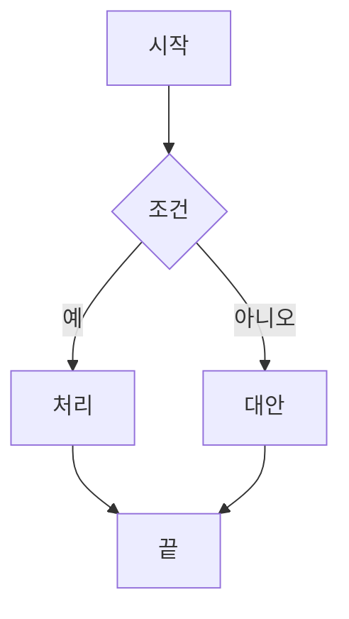
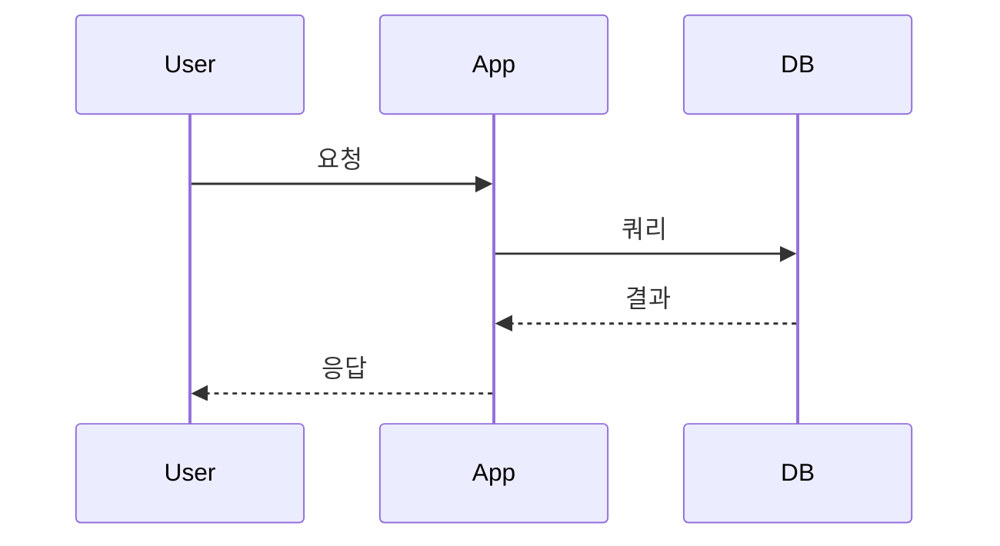
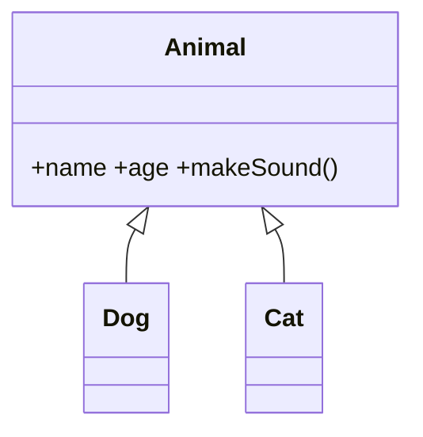

# Markdown to PDF Converter

> **완전 클라이언트 사이드** 마크다운 → PDF 변환기  
> 서버 없이 브라우저에서만 동작 · 프라이버시 퍼스트 · 오픈소스

  

## ✨ 주요 기능

| 기능 | 지원 | 라이브러리 |
|------|------|-----------|
| **GitHub Flavored Markdown** | ✅ | `marked.js` |
| **수학 공식 (LaTeX/KaTeX)** | ✅ 인라인 `$...$`, 블록 `$$...$$` | `KaTeX` |
| **Mermaid 다이어그램** | ✅ 플로우차트, 시퀀스, 클래스, 파이차트, 상태도 등 10+ 타입 | `Mermaid.js` |
| **이미지** | ✅ 외부 URL, Base64, 상대 경로 | 네이티브 `` |
| **코드 구문 강조** | ✅ 180+ 언어 | `marked` 내장 |
| **테이블 / 작업 목록 / 각주 / 정의 리스트** | ✅ | `marked` GFM |
| **고품질 PDF 생성** | ✅ 페이지 나누기, 여백, 헤더/푸터 | `html2pdf.js` |

## 🚀 빠른 시작

### 1. 로컬 실행 (서버 불필요)
```bash
# 방법 1: Python 간이 서버
cd Md2Pdf
python3 -m http.server 8080
# http://localhost:8080 접속

# 방법 2: Node.js serve
npx serve .

# 방법 3: 파일 직접 열기
# 브라우저에서 index.html 더블클릭 (file:// 프로토콜)
```

### 2. 사용법
1. **파일 업로드**: `.md` / `.markdown` / `.txt` 파일을 드래그 앤 드롭 또는 클릭하여 선택
2. **실시간 편집**: 좌측 편집기에서 수정 → 우측 미리보기 즉시 반영
3. **PDF 다운로드**: `PDF 다운로드` 버튼 클릭 또는 `Ctrl/Cmd + S`

### 3. 키보드 단축키
| 단축키 | 동작 |
|--------|------|
| `Ctrl/Cmd + S` | PDF 다운로드 |
| `Esc` | 업로드 화면으로 돌아가기 |

## 📦 배포 가이드

### Cloudflare Pages (추천: 무료, 무제한 대역폭)
```bash
# 1. GitHub에 푸시
git init && git add . && git commit -m "Initial commit"
git remote add origin https://github.com/yourname/md2pdf.git
git push -u origin main

# 2. Cloudflare Dashboard → Pages → Create a project
#    - Build command: (비워둠)
#    - Build output directory: /
#    - Root directory: /
```

### 기타 정적 호스팅
| 플랫폼 | 배포 명령 |
|--------|-----------|
| **Netlify** | `netlify deploy --prod --dir .` |
| **Vercel** | `vercel --prod` |
| **GitHub Pages** | Settings → Pages → Deploy from branch |
| **Firebase Hosting** | `firebase deploy` |
| **Surge.sh** | `surge . your-domain.surge.sh` |

> **빌드 과정 없음** — 정적 파일(`index.html`, `style.css`, `app.js`) 그대로 서빙

## 🏗️ 프로젝트 구조

```
Md2Pdf/
├── index.html      # 메인 HTML (CDN 라이브러리 로드)
├── style.css       # 스타일 + @media print 최적화
├── app.js          # 핵심 로직 (파싱, 렌더링, PDF 생성)
├── sample.md       # 테스트용 종합 샘플
└── README.md       # 이 문서
```

## 🔧 기술 스택 (전부 CDN, 빌드 도구 불필요)

| 라이브러리 | 버전 | 용도 | CDN |
|-----------|------|------|-----|
| `marked` | 15.x | 마크다운 → HTML 파싱 (GFM) | jsDelivr |
| `DOMPurify` | 3.x | XSS 방지 HTML 새니타이징 | jsDelivr |
| `KaTeX` | 0.16.x | 수학 공식 렌더링 | jsDelivr |
| `auto-render` | 0.16.x | 수식 자동 감지/렌더링 | jsDelivr |
| `Mermaid` | 10.9.x | 다이어그램 렌더링 | jsDelivr |
| `html2pdf.js` | 0.10.x | HTML → PDF (jsPDF + html2canvas) | jsDelivr |

## 🎨 지원하는 마크다운 문법

### 수학 공식 (KaTeX)
```markdown
인라인: $E = mc^2$
블록: $$ \int_{-\infty}^{\infty} e^{-x^2} dx = \sqrt{\pi} $$
정렬: $$ \begin{aligned} a &= b + c \\ &= d + e \end{aligned} $$
행렬: $$ \begin{pmatrix} a & b \\ c & d \end{pmatrix} $$
```

### Mermaid 다이어그램
```markdown





```

### 코드 블록 (180+ 언어)
```python
def fibonacci(n):
    a, b = 0, 1
    for _ in range(n):
        yield a
        a, b = b, a + b
```

### 테이블
| 기능 | 지원 | 비고 |
|------|:---:|---:|
| 정렬 | ✅ | `:---:` 가운데, `---:` 오른쪽 |
| 병합 | ❌ | HTML 직접 사용 필요 |

### 작업 목록
- [x] 완료된 작업
- [ ] 미완료 작업
  - [ ] 하위 작업

## ⚙️ 설정 커스터마이징

### PDF 옵션 변경 (`app.js` → `CONFIG.pdf`)
```javascript
pdf: {
  margin: 20,           // 여백 (mm)
  filename: 'doc.pdf',  // 기본 파일명
  image: { type: 'jpeg', quality: 0.98 },
  html2canvas: { 
    scale: 2,           // 렌더링 배율 (고해상도)
    useCORS: true       // 외부 이미지 CORS 허용
  },
  jsPDF: { 
    unit: 'mm', 
    format: 'a4',       // a4, letter, legal 등
    orientation: 'portrait' // portrait, landscape
  },
  pagebreak: { 
    mode: ['css', 'legacy'],
    avoid: ['tr', '.mermaid', '.katex-display', 'pre', 'blockquote']
  }
}
```

### Mermaid 테마 변경
```javascript
mermaid: {
  theme: 'default',  // 'default', 'dark', 'forest', 'base', 'neutral'
  // ...
}
```

### KaTeX 구분자 추가/변경
```javascript
katex: {
  delimiters: [
    { left: '$$', right: '$$', display: true },
    { left: '$', right: '$', display: false },
    { left: '\\(', right: '\\)', display: false },
    { left: '\\[', right: '\\]', display: true }
  ]
}
```

## 🔒 보안 & 프라이버시

- **완전 클라이언트 사이드**: 데이터가 서버로 전송되지 않음
- **DOMPurify**: XSS 공격 방지를 위한 HTML 새니타이징
- **CSP 호환**: 인라인 스크립트/스타일 최소화
- **오프라인 동작**: 초기 로드 후 인터넷 없이 사용 가능 (Service Worker 추가 시)

## 🌐 브라우저 지원

| 브라우저 | 지원 |
|----------|------|
| Chrome 80+ | ✅ |
| Firefox 75+ | ✅ |
| Safari 14+ | ✅ |
| Edge 80+ | ✅ |
| 모바일 Chrome/Safari | ✅ |

> **필수**: ES2020 지원 (Promise, async/await, optional chaining 등)

## 🐛 알려진 이슈 & 제한사항

| 이슈 | 상태 | 해결 방안 |
|------|------|-----------|
| 외부 HTTP 이미지 (Mixed Content) | ⚠️ 제한 | HTTPS 이미지 사용 또는 Base64 인코딩 |
| 매우 큰 파일 (>10MB) | ⚠️ 성능 저하 | 파일 분할 권장 |
| Mermaid 복잡한 다이어그램 렌더링 지연 | ⚠️ | `suppressErrorRendering: true`로 에러 무시 |
| 페이지 나누기 중 테이블/코드 블록 잘림 | ⚠️ | CSS `page-break-inside: avoid` 적용됨 |
| 모바일에서 가로 스크롤 필요 | 📝 설계 | 반응형 레이아웃으로 완화 |

## 🤝 기여하기

```bash
# 1. Fork & Clone
git clone https://github.com/yourname/md2pdf.git

# 2. 브랜치 생성
git checkout -b feature/amazing-feature

# 3. 수정 후 커밋
git commit -m "feat: Add amazing feature"

# 4. Push & PR
git push origin feature/amazing-feature
```

### 아이디어 환영
- [ ] 다크 모드 토글
- [ ] 다국어 지원 (i18n)
- [ ] 목차(TOC) 자동 생성 및 PDF 북마크
- [ ] 커스텀 CSS 테마 선택
- [ ] 드래그 앤 드롭 이미지 업로드 → Base64 변환
- [ ] PWA 지원 (오프라인 전체 동작)
- [ ] 일괄 변환 (여러 파일 ZIP 다운로드)

## 📄 라이선스

**MIT License** — 자유롭게 사용, 수정, 배포 가능

```
MIT License

Copyright (c) 2024

Permission is hereby granted, free of charge, to any person obtaining a copy
of this software and associated documentation files (the "Software"), to deal
in the Software without restriction, including without limitation the rights
to use, copy, modify, merge, publish, distribute, sublicense, and/or sell
copies of the Software, and to permit persons to whom the Software is
furnished to do so, subject to the following conditions:

The above copyright notice and this permission notice shall be included in all
copies or substantial portions of the Software.

THE SOFTWARE IS PROVIDED "AS IS", WITHOUT WARRANTY OF ANY KIND, EXPRESS OR
IMPLIED, INCLUDING BUT NOT LIMITED TO THE WARRANTIES OF MERCHANTABILITY,
FITNESS FOR A PARTICULAR PURPOSE AND NONINFRINGEMENT. IN NO EVENT SHALL THE
AUTHORS OR COPYRIGHT HOLDERS BE LIABLE FOR ANY CLAIM, DAMAGES OR OTHER
LIABILITY, WHETHER IN AN ACTION OF CONTRACT, TORT OR OTHERWISE, ARISING FROM,
OUT OF OR IN CONNECTION WITH THE SOFTWARE OR THE USE OR OTHER DEALINGS IN THE
SOFTWARE.
```

## 🙏 감사의 글

이 프로젝트는 다음 오픈소스 라이브러리들의 어깨 위에 서 있습니다:

- **[marked](https://marked.js.org/)** — 빠르고 유연한 마크다운 파서
- **[KaTeX](https://katex.org/)** — 가장 빠른 수학 공식 렌더러
- **[Mermaid](https://mermaid.js.org/)** — 텍스트 기반 다이어그램 도구
- **[html2pdf.js](https://github.com/eKoopmans/html2pdf.js)** — 클라이언트 사이드 PDF 생성
- **[DOMPurify](https://github.com/cure53/DOMPurify)** — XSS 방지 새니타이저

---

## 📞 지원 & 문의

- **버그 리포트**: [GitHub Issues](https://github.com/yourname/md2pdf/issues)
- **기능 요청**: [GitHub Discussions](https://github.com/yourname/md2pdf/discussions)
- **질문**: Issues에 `question` 라벨로 등록

---

**Made with ❤️ for developers who love Markdown**