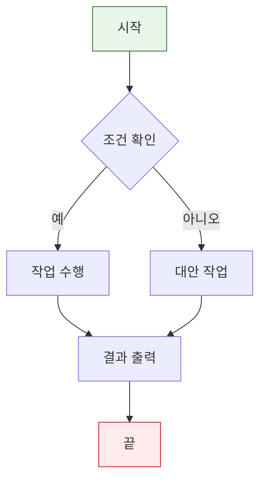
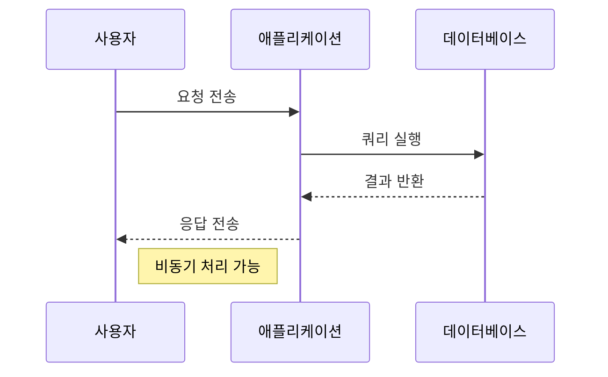
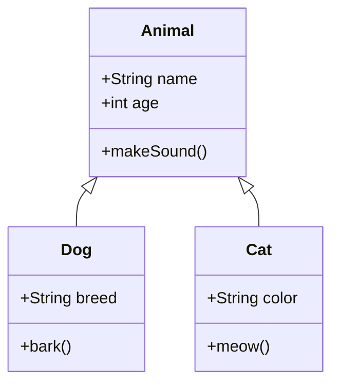
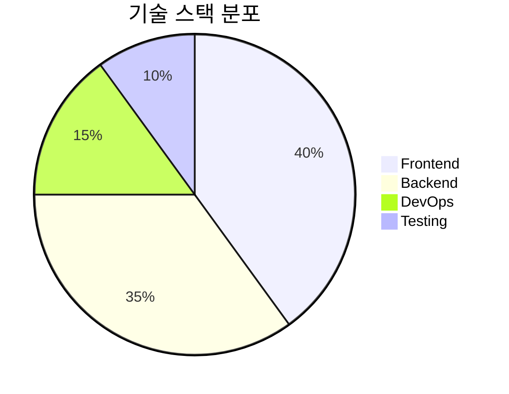
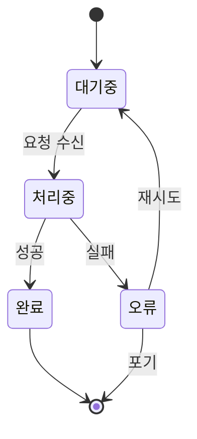

# Markdown to PDF Converter - Test Document

이 문서는 **이미지**, **수학 공식**, **Mermaid 다이어그램**, **테이블**, **코드 블록** 등 다양한 마크다운 기능을 테스트하기 위한 샘플입니다.

---

## 1. 기본 텍스트 및 서식

**굵은 텍스트**, *기울임*, ~~취소선~~, `인라인 코드`

> 인용문 블록입니다.
> 여러 줄로 작성할 수 있습니다.

---

## 2. 수학 공식 (KaTeX)

### 인라인 수식
아인슈타인의 유명한 공식: $E = mc^2$

오일러 항등식: $e^{i\pi} + 1 = 0$

확률 밀도 함수: $f(x) = \frac{1}{\sqrt{2\pi\sigma^2}} e^{-\frac{(x-\mu)^2}{2\sigma^2}}$

### 블록 수식
$$
\int_{-\infty}^{\infty} e^{-x^2} dx = \sqrt{\pi}
$$

$$
\begin{aligned}
\nabla \times \vec{E} &= -\frac{\partial \vec{B}}{\partial t} \\
\nabla \times \vec{B} &= \mu_0 \vec{J} + \mu_0 \epsilon_0 \frac{\partial \vec{E}}{\partial t}
\end{aligned}
$$

행렬 표현:
$$
\begin{pmatrix}
a_{11} & a_{12} & a_{13} \\
a_{21} & a_{22} & a_{23} \\
a_{31} & a_{32} & a_{33}
\end{pmatrix}
$$

---

## 3. Mermaid 다이어그램

### 플로우차트


### 시퀀스 다이어그램


### 클래스 다이어그램


### 파이 차트


### 상태 다이어그램


---

## 4. 이미지

### 외부 이미지 URL


### 상대 경로 이미지 (로컬 테스트용)
<!--  -->

---

## 5. 코드 블록

### Python
```python
def fibonacci(n):
    """피보나치 수열 생성"""
    a, b = 0, 1
    result = []
    for _ in range(n):
        result.append(a)
        a, b = b, a + b
    return result

# 사용 예시
print(fibonacci(10))  # [0, 1, 1, 2, 3, 5, 8, 13, 21, 34]
```

### JavaScript
```javascript
// 비동기 함수 예시
async function fetchUserData(userId) {
  try {
    const response = await fetch(`/api/users/${userId}`);
    if (!response.ok) throw new Error('User not found');
    return await response.json();
  } catch (error) {
    console.error('Failed to fetch user:', error);
    throw error;
  }
}
```

### TypeScript (타입 포함)
```typescript
interface User {
  id: string;
  name: string;
  email: string;
  roles: ('admin' | 'user' | 'guest')[];
}

function hasPermission(user: User, requiredRole: User['roles'][0]): boolean {
  return user.roles.includes(requiredRole);
}
```

### 쉘/터미널
```bash
# 프로젝트 설정
npm install
npm run dev

# 빌드
npm run build

# 테스트
npm test -- --coverage
```

---

## 6. 테이블

### 기본 테이블
| 기능 | 지원 여부 | 비고 |
|------|:--------:|------|
| GFM 테이블 | ✅ | 정렬 지원 |
| 이미지 | ✅ | 외부 URL, Base64 |
| 수학 공식 | ✅ | KaTeX (인라인/블록) |
| Mermaid | ✅ | 10+ 다이어그램 타입 |
| 코드 하이라이트 | ✅ | 언어별 구문 강조 |
| 작업 목록 | ✅ | 체크박스 상호작용 |

### 정렬이 있는 테이블
| 이름 | 나이 | 점수 | 합격 |
|:-----|:---:|---:|:----:|
| 김철수 | 25 | 95 | ✅ |
| 이영희 | 30 | 87 | ✅ |
| 박민수 | 22 | 72 | ❌ |
| 최수진 | 28 | 91 | ✅ |

---

## 7. 작업 목록 (Task Lists)

- [x] 프로젝트 초기 설정
- [x] 마크다운 파서 연동 (marked)
- [x] 수학 공식 렌더링 (KaTeX)
- [x] Mermaid 다이어그램 렌더링
- [x] 이미지 처리 (외부 URL, Base64)
- [ ] PDF 생성 최적화 (페이지 나누기)
- [ ] 다크 모드 지원
- [ ] 다국어 지원 (i18n)

---

## 8. 리스트

### 순서 없는 리스트
- 첫 번째 항목
  - 중첩 항목 1
  - 중첩 항목 2
    - 더 깊은 중첩
- 두 번째 항목
- 세 번째 항목

### 순서 있는 리스트
1. 첫 번째 단계
2. 두 번째 단계
   1. 세부 단계 A
   2. 세부 단계 B
3. 세 번째 단계

---

## 9. 수평선

---

## 10. 링크

[GitHub](https://github.com) | [KaTeX 공식 문서](https://katex.org/docs/supported.html) | [Mermaid 문법](https://mermaid.js.org/syntax/flowchart.html)

---

## 11. 각주

마크다운에서 각주를 사용할 수 있습니다[^1].

[^1]: 이것은 각주 내용입니다.

---

## 12. 정의 리스트

용어 1
: 정의 1-1
: 정의 1-2

용어 2
: 정의 2

---

*이 문서는 마크다운 → PDF 변환기의 기능을 종합적으로 테스트하기 위해 작성되었습니다.*